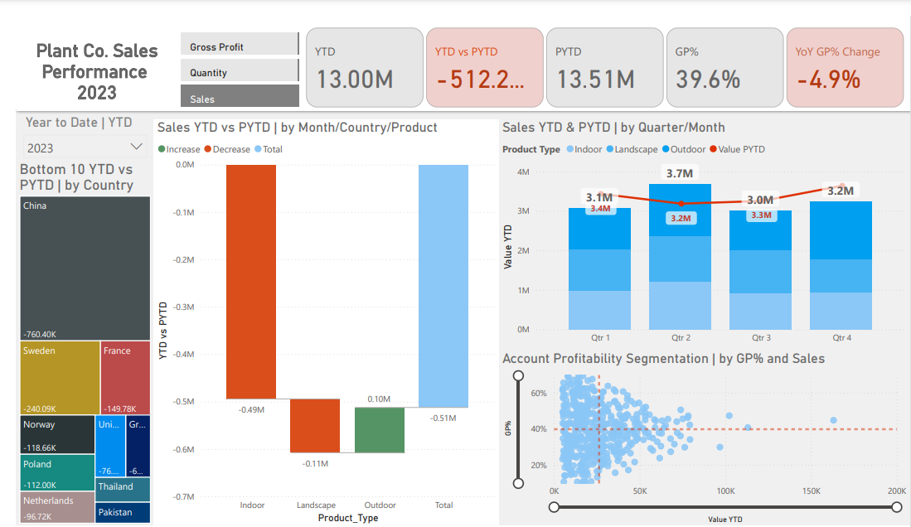

# Sales Trend Analysis of E-Commerce Plant Supplier from 2022-2024 

### _What was the yearly gross profit percent change?_
---

#### Project Background
Plant Landscapes, is a global e-commerce company that sells indoor and outdoor plants worldwide through it’s website.

The company has large amounts of data on its sales, product offerings and customer accounts. This project analyzes and synthesizes data from 2023 to 2024, into a performance metric dashboard in order to uncover critical insights that will improve Plant Landscape’s commercial success. 

Insights and recommendations are provided on the following key areas:

- Sales Trends Analysis: Evaluation of historical sales patterns  globally, focusing on Sales Revenue, Order Volume and Gross Profit
- Product Level Performance: An analysis of Plant Landscapes various product lines

An interactive PowerBi dashboard can be downloaded here.

The DAX code used to build the performance Model and calculated measures can be found here.

The DAX code used to clean, organize and prepare the data for the dashboard can be found here.  

#### Data Structure & Initial Checks
Plant Landscapes database structure as seen below consists of 3 tables:  Plant_Sales Plant_Accounts and Plant_Products

Prior to beginning the analysis, a variety of checks were conducted for quality control and familiarization with the dataset. The The DAX code used to clean, organize and prepare the data for the dashboard can be found here. (The DAX code used to inspect and perform quality checks can be found here)

#### Executive Summary

##### Overview of Findings

After peaking in 2022, the company’s sales have continued to decline, with significant drops in 2023. Key performance indicators have shown year-over-year decreases in gross profit by 5% and sales revenue by 4% and despite a 3% gain in the volume sold, the sales average per order declined by 7%. While this decline can be broadly attributed to return to pre-pandemic normalcy, the following sections will explore additional contributing factors and highlight key opportunity areas for improvement.

Below is the overview page from the PowerBi dashboard and more examples are included throughout the report. The entire interactive dashboard can be downloaded here.

##### Dashboard showing Gross Profit metrics

##### Dashboard showing Sales metrics

##### Dashboard showing Quantity/ Volume metrics

---
#### Sales Trends
* The company’s sales peaked in November 2022 with 51,052 orders totaling $1,383,639 monthly sales revenue. This corresponds with an increase in winter holiday consumer spending.
* Beginning in February 2023, sales revenue hit a company lifetime low with the company earning just over $807k about 30% less than the previous year.
* Despite an upward trend with April 2023 hitting it’s peak revenue at $1,342,505 the full year 2023 remained steady with an overall -5% sales revenue decline primarily due to lower than expected November holiday sales and February sales.
* China made up 35% of the sales revenue from the company’s 50 countries and was the highest selling country in 2022. Despite their 2022 sales, the country ended 2023 with a 706.40k revenue decline in 2023.

---
#### Product Performance
* Veronica prostrata L (Outdoor), was the top selling plant in 2023 bringing in $80,141 in sales revenue, compared to prior year when Pleurothallis domingensis Cogn. (Landscape) was the top selling plant. 

* Although orders for Outdoor plants increased by 14%, orders and brought in $96k more in sales revenue, Indoor and Landscape plants declined by a combined 5% and resulted in a nearly $608k decline in sales revenue for 2023.
* Plants in the Indoor category was the least performing category with a decline of 13% in gross profit, contributing to 30.8% in total gross profit compared to Landscape and Outdoor plants.

---
#### Recommendations

* With a 14% increase in Outdoor sales and a 4% increase in gross profit, focusing on the top 5 outdoor plants with the most sales is crucial. Looking for ways to reduce the cost of goods sold and perform a re-pricing strategy on the top and least performing outdoor plants would provide more revenue-enhancing opportunities.
* With an 11% decline in Indoor plant sales and a 13% decrease in gross profit, focusing on the top 5 outdoor plants with the most sales is crucial. Looking for ways to reduce the cost of goods sold and perform a re-pricing strategy on the top and least performing indoor and landscape plants would provide more revenue-enhancing opportunities.
* Because China made up 35% of the sales revenue from the company’s 50 countries, sales revenue relied heavily on China’s yearly output. Performing an active client vs non-active client analysis to increase client retention and sales growth in the bottom-performing countries would diversify their sales country distribution.
